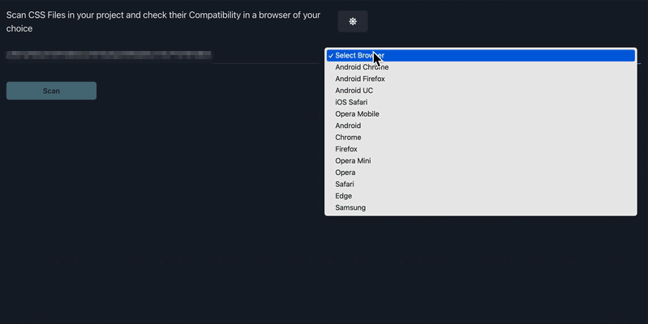

## Scanner App

Scanner app is a end to end application under browser-scan apps.
It runs a node server ,serving react powered UI.

Use it to run as a stand alone server for scanning CSS content in you local project and check their compatibility against a browser of your choice.

The Scanned result is displayed in a tabular view in a per line per file basis and the non compatible properties

## Installation

- With NPX
  `npx @browser-scan/scanner-app`

## Server

- The above commands spins up a node server at `[::]:8081`
- It serves the standard browser scan UI and lets you scan your local project for CSS compatibility

## How does it look

